<h1 align="center">Hi 👋, I'm MD. Rifat Hossain</h1>
<h3 align="center">A passionate web developer from Dhaka</h3>

  

<!-- 
  
 -->

  

- 🌱 I’m currently learning **Inertia JS**

- 👨‍💻 Some of my projects are available at [rhossain.dev](rhossain.dev)

- 📫 How to reach me **rifat.h@hotmail.com**

<h3 align="left">Connect with me:</h3>

  <code></code>
  <code></code>
  <code></code>
  <code></code>

<h3 align="left">Languages and Tools:</h3>

  <code></code>
  <code></code>
  <code></code>
  <code></code>
  <code></code>
  <code></code>
  <code></code>
  <code></code>
  <code></code>
  <code></code>
  <code></code>
  <code></code>
  <code></code>
  <code></code>
  <code></code>
  <code></code>
  <code></code>
  <code></code>

  
  <!--  
  
    -->
  

